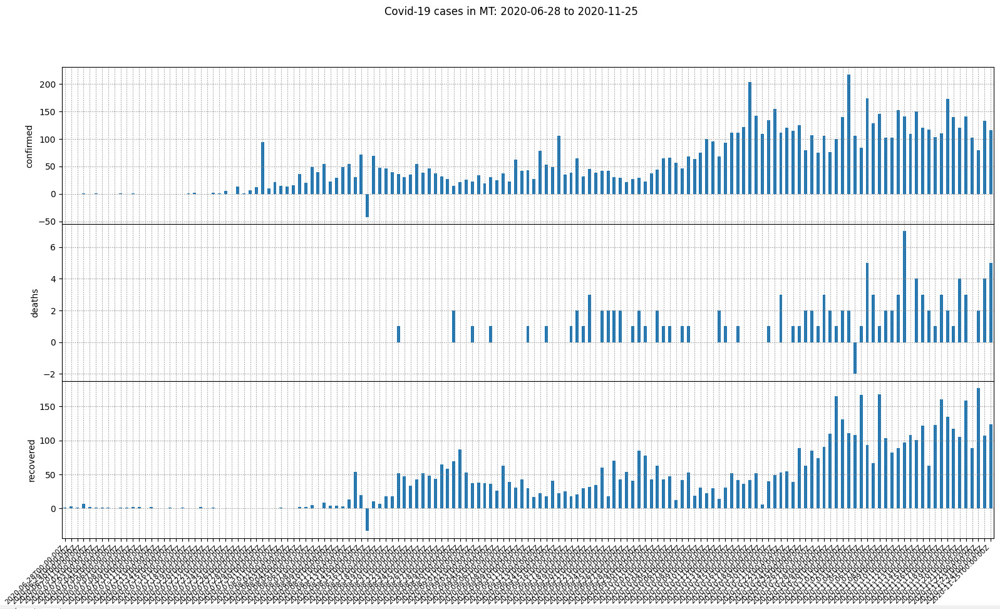

covid-19-stats
==============
Python functions to retrieve and display or export Covid-19 stats from [Coronavirus COVID19 API](https://covid19api.com/)

Features
--------
- __Request__ different sets of data from _API_
- __Reshape data__ to fit specific requirements
- Create __dataframes__ with _pandas_ library
- __Plot__ data using _Matplotlib_ library

This is a learning and __showcase project__ that I developed as part of my __learning process__, with a relevant subject as of today.

Development
-----------

To develop this app locally:

1. Make sure you are using python3. If not sure run check running the command 
```console
$ python --version
```

2. Install pipenv for package management and virtual environment (see how to install [here](https://pipenv.pypa.io/en/latest/#install-pipenv-today)

```console
$ pip install pipenv
```

3. Clone this repository
```console
$ git clone https://github.com/fviaren/covid-19-stats
```

4. Install dependencies
```console
$ pipenv install
```

5. Activate pipenv shell
```console
$ pipenv shell
```

Happy coding!

Functions
-----------------
The functions are divided into **separate files** or modules for better efficiency and to follow best practices. An _interface_ covid_19_stats.py file contains **3 main functions** that will use support functions from other files.

* ### **_summary_df:_**

Returns a dataframe with summary data of COVID-19 cases.
```python
def summary_df(save_df=False) -> "pandas.core.frame.DataFrame"
```

It will:
- request to the api a summary of all countries,
- select data points or total and new cases of confirmed, recoveries and deaths,
- determine the rates of recoveries and deaths based on this data,
- create a dictionary with this data and with it
- generate a dataframe.
- This dataframe can be saved by passing an argument of "True".

* ### **_compare_countries_df:_**

This function returns a dataframe to compare covid stats form 1 or more countries. The dataframe is pivoted for better visibility and analysis. The dataframe may be saved as a csv file.

```python
def compare_countries_df(
    countries=list,
    daily=False,
    last_date=datetime.date.today() - datetime.timedelta(1),
    days_number=30,
    save_df=False,
) -> "pandas.core.frame.DataFrame":
```

**countries:** country ISO2 codes as strings, e.g. ['BR','NO','MA'].

**daily:** defines if the data wanted is by day or accumulated/total.

**last_date:** last date to report, format *"%Y-%m-%d"* e.g. *"2020-11-18"*.

**days_number:** number of days for which data is required.

**save_df:** save dataframe as csv in local directory.

**Limitations:** At the moment this function makes 3 requests per country to the API, one per case status. Due to the rate limitation of 10 requests per second, for more than 3 countries the function will take longer to run with a delay of 3 seconds between a 429 error (too many requests) and the next request (after 3 countries there will be an added request of 3 seconds every 3 new countries) (see TODO section)

* ### **_plot_covid_stats:_**

This function creates a dataframe to compare (or see) Covid-19 stats form 1 or more countries, and plots the data into 3 subplots, one per case status.
```python
def plot_covid_stats(
    countries=list,
    daily=False,
    last_date=datetime.date.today() - datetime.timedelta(1),
    days_number=30,
    save_df=False,
    save_img=False,
) -> None:
```
**countries:** country ISO2 codes as strings, e.g. ['BR','NO','MA'].

**daily:** defines if the data wanted is by day or accumulated/total.

**last_date:** last date to report, format *"%Y-%m-%d"* e.g. *"2020-11-18"*.

**days_number:** number of days for which data is required.

**save_df:** if True save dataframe as csv in local directory.

**save_img:** if True save plot as png file or not (and show it instead)

**Limitations:** At the moment this function makes 3 requests per country to the API, one per case status. Due to the rate limitation of 10 requests per second, for more than 3 countries the function will take longer to run with a delay of 3 seconds between a 429 error (too many requests) and the next request (after 3 countries there will be an added request of 3 seconds every 3 new countries) (see TODO section)

Usage
-----
### As a command line
The _getopt_ module is used here to be able to use this functions as a command line.
This program takes 7 short form options:

Require argument:
- **-c** : countries. If this option is not used, the function summary_df() will be called
- **-l** : last date. In format %Y-%m-%d
- **-n** : days number. A number

- **-p** : plot. If this option is taken, the function plot_covid_satas() will be called
- **-d** : daily
- **-s** : save dataframe
- **-i** : save image

If there is an error witht he options and arguments passed, an exception is raised and the error will be printed. E.g.: `option -l requires argument`, or `option -m not recognized`

If no options are passed, the summary_df() function will be called.

If `-p` is not passed, and countries are passed in `-c`, the compare_countries_df() function will be called.

If `-d`, `-s`, `i`, `-l` or `-n` are not passed, the default values will be used.

Here some examples to call the program (same examples as in *As a library* section):

#### Example 1
```console
> python covid_19_stats.py
```
Returns: a pandas dataframe and saves it as a csv file in the current directory:


#### Example 2

```console
> python covid_19_stats.py -c NO,NZ -d -s
or
> python covid_19_stats.py -cNO,NZ -ds
```
Returns: a dataframe with the daily confirmed, recovered and death cases of the countries Norway and New Zealand from yesterday to 30 days backwards and saves it into the local directory as a csv file.

Filename: Covid-19 Stats_NO-NZ_2020-10-22_2020-11-21_1.csv


#### Example 3

```console
> python covid_19_stats.py -c AR,DE,BR -d -s -p
or 
> python covid_19_stats.py -cAR,DE,BR -dsp
```
Returns: None. Creates a dataframe, saves it into the local directory as a csv file and shows a plot of the data in 3 line subplots comparing the daily confirmed, recovered and death cases of the countries Argentina, Germany and Brazil from yesterday to 30 days backwards.

Filename: Covid-19 Stats_AR-DE-BR_2020-10-22_2020-11-21_1.csv


#### Example 4

```console
> python covid_19_stats.py -c IN,MA -l 2020-10-31 -n 50 -i -p
or 
> python covid_19_stats.py -cIN,MA -l2020-10-31 -n50 -ip
```
Returns: None. Creates a dataframe and then a plot with 3 line subplots comparing the total/accumulated confirmed, recovered and death cases per day of the countries India and Morocco from October 31st 2020 to 50 days backwards, which is saved  into the local directory as a png file.

Filename: Covid-19 Stats_IN-MA_2020-09-11_2020-10-31_1.png


#### Example 5

```console
> python covid_19_stats.py -c MT -n150 -d -p
or 
> python covid_19_stats.py -cMT -n150 -dp
```
Returns: None. Creates a dataframe, and then shows a plot with 3 bar subplots comparing the daily confirmed, recovered and death cases of the country Malta from yesterday to 150 days before.



### As a library

#### Example 1
```python
summary_df(True) 
```
Returns: a pandas dataframe and saves it as a csv file in the current directory:


#### Example 2

```python
compare_countries_df(['NO', 'NZ'], daily=True, save_df=True)
```
Returns: a dataframe with the daily confirmed, recovered and death cases of the countries Norway and New Zealand from yesterday to 30 days backwards and saves it into the local directory as a csv file.

Filename: Covid-19 Stats_NO-NZ_2020-10-22_2020-11-21_1.csv


#### Example 3

```python
plot_covid_stats(['AR', 'DE', 'BR'], daily=True, save_df=True)
```
Returns: None. Creates a dataframe, saves it into the local directory as a csv file and shows a plot of the data in 3 line subplots comparing the daily confirmed, recovered and death cases of the countries Argentina, Germany and Brazil from yesterday to 30 days backwards.

Filename: Covid-19 Stats_AR-DE-BR_2020-10-22_2020-11-21_1.csv


#### Example 4

```python
plot_covid_stats(['IN', 'MA'], daily=False, last_date='2020-10-31', 
    days_number=50, save_df=False, save_img=True)
```

Returns: None. Creates a dataframe and then a plot with 3 line subplots comparing the total/accumulated confirmed, recovered and death cases per day of the countries India and Morocco from October 31st 2020 to 50 days backwards, which is saved  into the local directory as a png file.

Filename: Covid-19 Stats_IN-MA_2020-09-11_2020-10-31_1.png


#### Example 5

```python
plot_covid_stats(['MT'], daily=True, days_number=150)
```
Returns: None. Creates a dataframe, and then shows a plot with 3 bar subplots comparing the daily confirmed, recovered and death cases of the country Malta from yesterday to 150 days before


TODO
----

- [x] Command line usage
- [ ] Add option to use function with multiple requests OR sorting all data
    - [x] Add delay in process for multiple requests (more countries possible)
    - [ ] Sort request of all data in dict comprehensible by pandas/matplotlib with primary index date, then status then country, for 1 request per country for all cases status
- [ ] Beautify plot
    - [ ] Modify xaxis ticks date format & frequency
- [ ] Cache data every x period of time
- [ ] Add directory argument to save file
- [ ] Specify dimensions of plot to save to png
